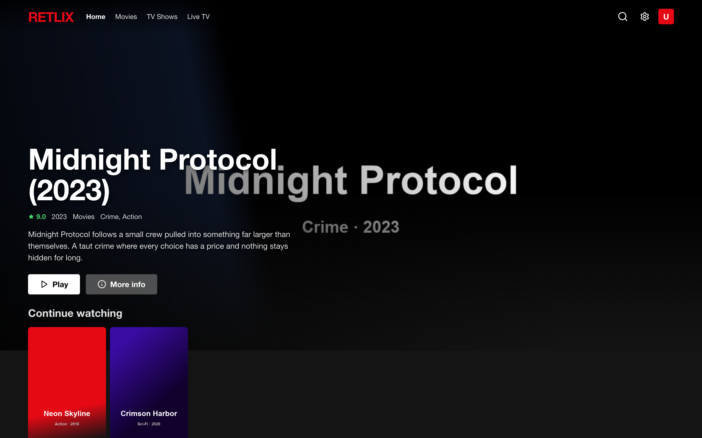
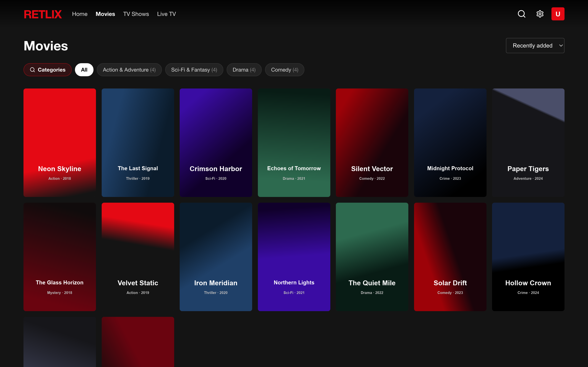
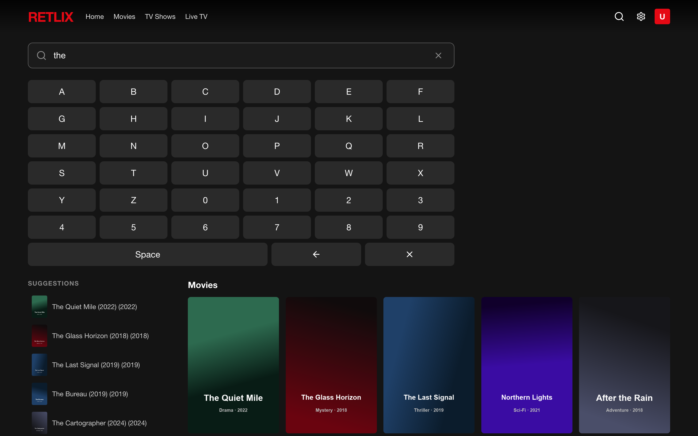

<div align="center">

# 🎬 Retlix

**A self-hosted, Netflix-style web app for your Xtream Codes IPTV line.**

Connect one provider, pull the whole catalog into a local database, and browse & watch movies, series and live TV with a slick, Netflix-grade interface — on your computer, phone, or smart-TV browser.


</div>

> [!IMPORTANT]
> **Bring your own legal IPTV subscription.** Retlix ships with **no** content, channels, or credentials — it's only a player for an [Xtream Codes](https://en.wikipedia.org/wiki/Xtream_Codes) line **you** already pay for. Not affiliated with Netflix. For personal use on your own network.

---

## 📸 Screenshots

> Demo data — placeholder titles & artwork, no real content.

| Home | Browse | Search |
|:---:|:---:|:---:|
|  |  |  |

---

## 📑 Table of contents
- [Features](#-features)
- [Quick start (Docker)](#-quick-start-docker)
- [Manual install](#%EF%B8%8F-manual-install-without-docker)
- [Multilingual metadata (TMDB)](#-multilingual-metadata-tmdb)
- [Configuration](#%EF%B8%8F-configuration)
- [How it works](#-how-it-works)
- [Project structure](#-project-structure)
- [FAQ & limitations](#-faq--limitations)
- [Publish to GitHub](#-publish-your-own-copy-to-github)
- [License](#-license)

---

## ✨ Features

**Library**
- One-time provider setup — paste your Xtream URL + username + password, validated on connect.
- Full catalog synced into a local **SQLite** database: categories, movies, series, live channels.
- **Two sync modes**, both incremental, resumable, and kept running even if you close the tab:
  - **Update library** — provider details (plot, cast, director, episodes). Fast.
  - **Download everything locally** — adds IMDb cast photos + pre-cached artwork.
- On-disk **image cache** (posters, backdrops, episode stills, actor photos).

**Discovery**
- Netflix-style **home**: hero banner, *Continue Watching*, and recommendation rows (by category, lead actor, director).
- **Browse** movies / series / live with category chips and sorting.
- **Global search** across titles **and actors**, with as-you-type suggestions, typo-tolerant *"did you mean"*, and an **on-screen keyboard** (D-pad / mouse friendly for TVs). The query is stored in the URL, so **Back** restores your search and scroll position.
- Rich **detail modal**: synopsis, cast with photos, year, rating, genre, director, trailer, seasons & episodes.

**Player**
- **Continuous, Netflix-style buffering**: stall watchdog with auto-recovery, transparent reconnect on drops, next-episode prefetch, debounced spinner.
- Plays **MP4** natively; **MKV / AVI** stream through an on-the-fly **ffmpeg → HLS** pipeline so they actually play in the browser.
- **Multi-audio language switching** and **subtitles** (extracted to WebVTT, Netflix-styled).
- Hardware video encoding on macOS (`h264_videotoolbox`) so even 4K/HEVC transcodes in real time; `libx264` elsewhere.
- Resume playback, *Continue Watching* sync, auto next-episode, Netflix-style scrubber, top-right info card, double-click fullscreen, full keyboard shortcuts.

**Languages**
- Full **multilingual UI** — 🇮🇹 Italiano · 🇬🇧 English · 🇪🇸 Español · 🇫🇷 Français · 🇩🇪 Deutsch · 🇵🇹 Português. Auto-detects your browser language, switchable in Settings.
- Optional **multilingual content** via [TMDB](#-multilingual-metadata-tmdb): plots & genres in the selected language.

---

## 🚀 Quick start (Docker)

The launcher detects your OS, checks Docker, builds the image (Node + ffmpeg + dependencies are installed **inside** the container), and starts everything:

```bash
git clone https://github.com/<your-username>/retlix.git
cd retlix
./run.sh
```

Then open **http://localhost:3000**, connect your provider, and run a sync.
On a phone or TV, use the **network URL** that `run.sh` prints (e.g. `http://192.168.1.50:3000`).

Prefer raw compose? Same thing:

```bash
docker compose up -d --build      # build + start
docker compose logs -f            # follow logs
docker compose down               # stop
```

Your library and credentials live in `./data` on the host (a mounted volume) — **never** baked into the image.

> ✅ Verified: image builds on amd64/arm64, boots to the setup screen on a clean volume, ships ffmpeg + ffprobe, and the native SQLite module works out of the box.

---

## 🛠️ Manual install (without Docker)

Requires **Node.js ≥ 18** and **ffmpeg** on your `PATH` (for MKV/AVI playback).

```bash
git clone https://github.com/<your-username>/retlix.git
cd retlix
npm install
npm run build      # build the React UI
npm start          # production server on http://localhost:3000
```

Development (hot-reload backend + Vite frontend):

```bash
npm run dev        # or ./start.sh
```

---

## 🌍 Multilingual metadata (TMDB)

The provider/IMDb serve metadata in a single language. To show **plots & genres in your chosen language**, add a free [TMDB](https://www.themoviedb.org/) API key:

1. Create a free account → **Settings → API** → copy the **API Key (v3 auth)**.
2. In Retlix: **Settings → Language → "Plots & genres in other languages (TMDB)"** → paste the key → **Save**.
   *(or set `TMDB_API_KEY` as an env var — see docker-compose.yml)*
3. Pick a language and open a title — plots/genres appear translated and are cached.

The key is stored in your local `data/` volume (never in the image, never returned by the API). Titles, category names and cast remain as the provider/IMDb provide them.

---

## ⚙️ Configuration

No secrets in code — your provider and TMDB key are configured **in the app** and stored locally in `data/`.

| Variable        | Default   | Description                                       |
|-----------------|-----------|---------------------------------------------------|
| `PORT`          | `3000`    | HTTP port                                         |
| `HOST`          | `0.0.0.0` | Bind address (default exposes it on the LAN)      |
| `TMDB_API_KEY`  | —         | Optional; multilingual plots/genres (or set in UI)|
| `SYNC_CONCURRENCY` | auto   | Override per-title sync parallelism               |

The SQLite DB + image cache live in **`data/`** (gitignored & dockerignored). To start fresh, delete it or use **Settings → Disconnect**.

---

## 🧠 How it works

```
Xtream provider ──▶ Express backend ──▶ SQLite (local library + cache)
       │                  │
   TMDB / IMDb ───────────┤  enrichment (plots, genres, cast photos, i18n)
                          │
   browser  ◀── React UI ─┤  all streams & images are PROXIED through the
   (hls.js / native)      │  backend, so provider credentials never reach it
                          └─ ffmpeg ──▶ on-the-fly HLS for MKV/AVI
                                        (video + multi-audio + WebVTT subs)
```

- **Backend** (Express + better-sqlite3): proxies every stream and image (hides credentials, avoids CORS), syncs & enriches the catalog, serves the API and the built UI.
- **Frontend** (React + Vite): the Netflix-style UI; plays HLS via `hls.js` and progressive MP4 natively.
- **Transcode** (ffmpeg): MP4 plays directly; MKV/AVI are transcoded to HLS on demand — video copied when already H.264 (or hardware-encoded), audio tracks exposed for language switching, subtitles converted to WebVTT.

---

## 📁 Project structure

```
server/        Express API, sync/enrichment, stream & image proxy, ffmpeg pipeline, TMDB
src/           React app (pages, components, player, i18n)
data/          SQLite DB + image cache  (created at runtime, never committed)
Dockerfile     multi-stage build (compiles native deps, ships ffmpeg)
docker-compose.yml
run.sh         environment-aware one-command launcher
```

---

## ❓ FAQ & limitations

- **MKV/AVI need ffmpeg** — included in Docker; install it yourself for the manual setup.
- **IMDb cast photos** come from a free, rate-limited API, so they fill in gradually; provider metadata is always primary.
- **TMDB localization** covers plots & genres (on-demand, cached); titles & cast stay as provided.
- **Single provider, single user, no app login** — run it on a network you trust.
- Seeking inside a transcoded title restarts the transcode from the seek point on demand.

---

## 📦 Publish your own copy to GitHub

```bash
cd retlix
git init
git add .
git commit -m "Initial commit: Retlix"
# create an empty repo named "retlix" on GitHub, then:
git branch -M main
git remote add origin https://github.com/<your-username>/retlix.git
git push -u origin main
```

`.gitignore` already excludes `node_modules/`, `dist/`, and **`data/`** — so your library, credentials **and TMDB key never leave your machine**. Run `git status` and confirm `data/` is not staged before pushing.

---

## 📄 License

[MIT](LICENSE) — provided as-is. You are responsible for the legality of the IPTV source you connect.
